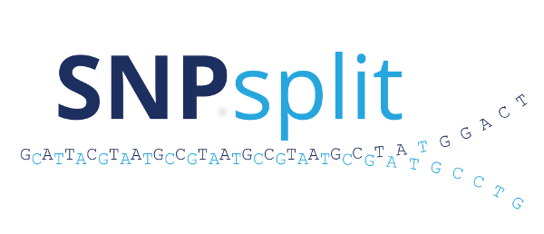

 

## Allele-specific alignment sorting

**Update December 2022:**

SNPsplit has now been updated to work with new release of the [Mouse Genomes Project](https://www.mousegenomes.org/). This means that it will now assume the GRCm39 mouse genome build by default, and use the latest SNP annotation file (v8: [mgp_REL2021_snps.vcf.gz](https://ftp.ebi.ac.uk/pub/databases/mousegenomes/REL-2112-v8-SNPs_Indels/mgp_REL2021_snps.vcf.gz)).

## Installation

SNPsplit is written in Perl and is executed from the command line. To install SNPsplit simply download the latest release of the code from the [Releases page](https://github.com/FelixKrueger/SNPsplit/releases) and extract the files into a SNPsplit installation folder.

SNPsplit requires the following tools installed and ideally available in the `PATH`:
- [Samtools](http://samtools.sourceforge.net/)

## Documentation
The SNPsplit documentation can be found here: [SNPsplit User Guide](./SNPsplit_User_Guide.md)

## Links
- SNPsplit publication at F1000 Research:
  * https://f1000research.com/articles/5-1479/v2
  
- Here is a link to the [SNPsplit project site](https://www.bioinformatics.babraham.ac.uk/projects/SNPsplit/) at the Babraham Institute.

## Credits

SNPsplit was written by Felix Krueger, as part of the [Babraham Bioinformatics](https://www.bioinformatics.babraham.ac.uk) group.

 

